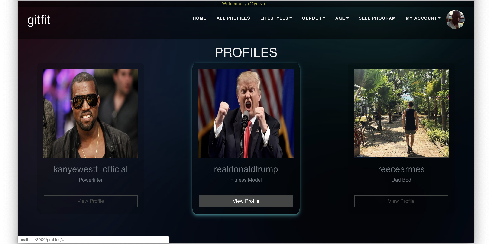
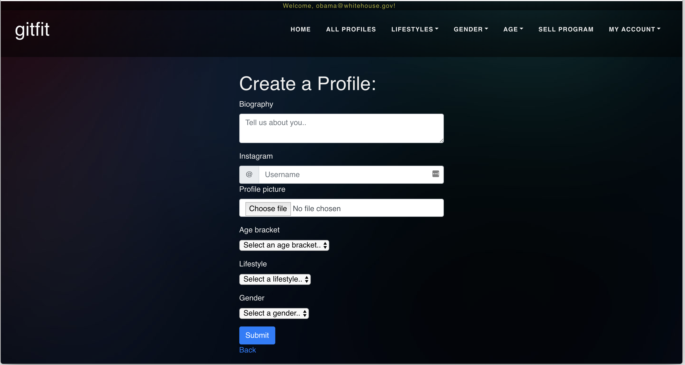
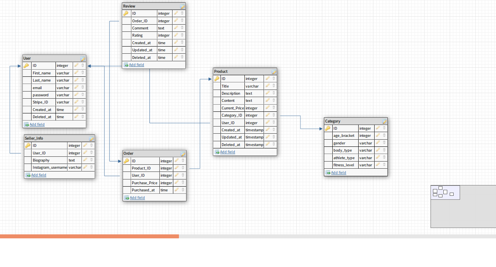
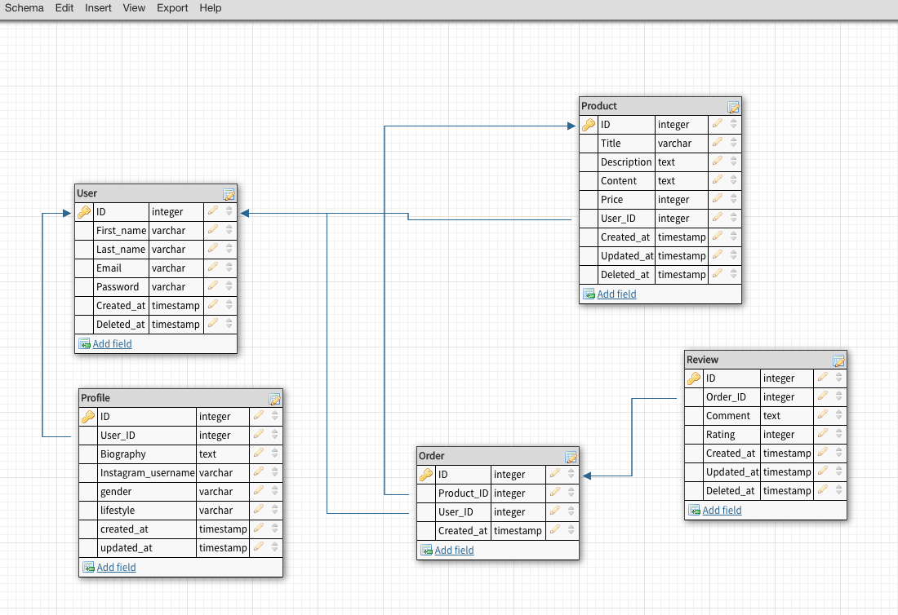
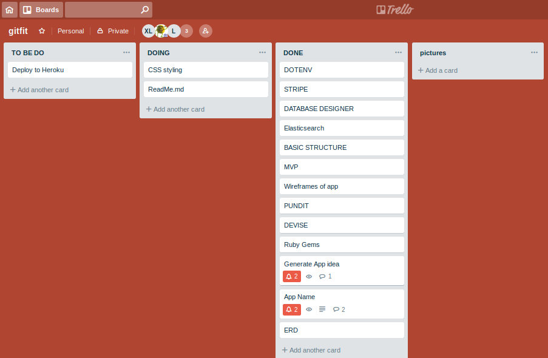

# gitfit

A rails app by REBAXI

---
## Project README Requirements

[Published app link](https://calm-lowlands-96397.herokuapp.com/ "gitfit") 

[Github repository link](https://github.com/REBAXI/gitfit "gitfit on github") 

**Problem definition / purpose**  
Please refer to the short answer question 1 & 2

**Functionality / features**  
+ Landing page with fade-in animations.  
  

+ A Navbar that makes navigating the site and filtering through categories quick and easy.  

+ Ability to browse profiles and products without having to sign up.  

+ In-broswer product editing capability.   

+ Providing your Instagram handle will pull your Instagram profile picture to serve as your gitfit profile picture.

**Tech stack**  
Please refer to the short answer question 5.

**Instructions on how to setup, configure and use your App.**  
To access our app simply go to the provided github repository link above, fork and clone the repo locally. Open your cloned repo with you code editor or choice and run `bundle` to install all the gems required to run our app. You will also need to sign up for Stripe and AWS to configure those features.

**Design process**  
Initially, we considered making an app that was a hybrid of Airtasker and UberEats, and an app that sold stickers. We decided against these as the market for them were too saturated. We settled on gitfit when we saw an opening in the market for specialised training programs with a social media backing. 

**User stories**  
Please refer to the short answer question 15.

**A workflow diagram of the user journey/s.**  
Journey to becoming a seller as a user and unregistered user.  

  
  

**Wireframes**  
Our end product ended up deviating from our initial wireframes but the basic UI functions remain the same.  

**Database Entity Relationship Diagrams**  
Please refer to short answer quesiton 14.

**Project plan & timeline**  
Please refer to short answer quesiton 17.

## Short Answer Questions

**1. What is the need (i.e. challenge) that you will be addressing in your project?** 

Our app is called GitFit, and like YouTube or Instagram, GitFit makes it possible for influencers to profit from sharing their lifestyles with their audience, but through a written medium (which allows for easier and more detailed dissemination of details) instead of video or picture posts. The aim of our app is to connect people to their fitness idols and make their personal health goals easier to achieve. To do this, we are diversifying our supply pool by welcoming people of all backgrounds and disciplines to share their story with potential customers; whether they are a martial artist, gymnast or vegan. 

**2. Identify the problem you’re trying to solve by building this particular marketplace App? Why is it a problem that needs solving?**

The current fitness landscape lacks diversity and is such that traditional personal trainers make up a large majority of providers of fitness programs. We think there is a benefit in allowing people of different fitness backgrounds to share how they train and eat to acheive peformance goals; a basketball player would train and eat differently to a long-distance runner and a vegan bodybuilder will eat and train differently to a ballerina on keto. With this kind of diversity, more people will be able to find and identify with a program supplier that share the same goals and help them achieve these realistically.

**3. Describe the project you will be conducting and how your App will address the needs.**

A 2 sided marketplace add that ties in social media, namely Instagram,to help extend online reach will help address the problem we're trying to solve. A lot of instagramming is lifestyle promotion as it is, so it makes sense for us to exploit this. Our fitness ambassadors have an incentive to use GitFit as it will provide an additional source of income, and their audience will buy into their programs in an effort to emulate the fitness lifestyles of those that they admire. We are also providing categories that the suppliers will attach to their products. This allows users to be able to easily filter through the different programs available to them.

**4. Describe the network infrastructure the App may be based on.**  

Heroku is a cloud platform service initially made to support webpages coded in Ruby. Heroku integrates with Rails seamlessly through use of Git and the Heroku gem. Deploying to Heroku means that we are essentially asking Heroku to run `rails s` on their cloud server like we would a local server.  Heroku will now host our website which enables us to access our webpage through the internet. Amazon Web Services will help with storing and hosting our user submitted images and related data.    

**5. Identify and describe the software to be used in your App.**

To construct our app, we will be using: 
+ Ruby  
Yukihiro Matsumoto wanted to create a programming language that shifted the focus from machines to humans. And so Ruby, an object orientated language written in C, was designed to be natural to read and easy to write and focuses on simplicity and succinctness.   

+ Ruby on Rails  
Rails is a development framework which comes with a set of conventions that takes care of the complex and repetitive tasks that comes with building websites and applications, making it easier and faster to setup. 

+ HTML  
HTML is the publishing language of the internet. It is responsible for the actual content on a webpage, i.e. the paragraphs and words.

+ CSS  
CSS lets you style your HTML elements i.e. the font-size and colour. CSS makes your webpage accessible as it elevates the presentation and puts the ease of use at the forefront.

**6. Identify the database to be used in your App and provide a justification for your choice.**  

We decided to go with PostgreSQL for our app database needs, the alternative being SQLite. Although SQLite is a good lightweight, speedy, all-rounder , we went with PostgreSQL for its ergonomics and complete feature set. PostgreSQL supports almost all datatypes compared to SQLite's supported 5, handles complex operations with ease, is reliable and extendable. The Rails community has also developed gems (e.g. marginalia) to help with more complex database interactions which works well with PostgreSQL. Heroku also plays nicely with PostgreSQL as its Cloud database is based on PostgreSQL, which will be handy once we deploy. 

**7. Identify and describe the production database setup (i.e. postgres instance).**  

Our production database is made up of the following: 

| Models     |      | 
| ------------- |:-------------:|
| Users     | stores user data such as names, emails and passwords |
| Profiles    | stores user profiles, which function as our 'shops'| 
| Products| this will handle the product related specifics e.g. price, description, content etc. |  
|Orders |deals with purchase transaction information such as time of purchase, purchase price |
| Reviews | stores the comments made about the products |  

**8. Describe the architecture of your App.**  

Along with the above models we also have the following controllers:            
+ User   
+ Profiles 
+ Products  
+ Orders  
+ Charges  

And associated required views. The User, Profiles and Products controller each have methods that will allow users the create, edit and destoy actions (CRUD). The Orders and Chargers controllers work in tandem to complete and record purchase transactions. Controllers allows communication and data interpretation between the models and views. The view encompasses the user interface that visitors will use to navigate and interact with your site. 
  
**9. Explain the different high-level components (abstractions) in your App.**

Along with the default gems that Rails loads new projects with we have added several of our own to aid in the running and development of our app. The Devise gem for example, helped greatly to abstract user authentication. We also used Pundit, Stripe, AWS to help aide in site usability and function. Active record allows users to manipulate the data within a model with CRUD methods. 

**10. Detail any third party services that your App will use.**  

We are using Amazon Web Services (AWS) to host images on our site, alleviating server needs on our end. 

Stripe eliminates the hassle of having to store and encrypt  snesitive data required in the payment process as it handles all of it for us, offloading liability on our end in the event of a data breach.  

**11. Describe (in general terms) the data structure of marketplace apps that are similar to your own (e.g. eBay, Airbnb).**  

Two-sided marketplace like Lynda and Udemy offer intangible contents for sale, much like our own app. They are more restrictive as to who can list products but basic functions are the same. They have users that can be both users and sellers. Sellers will have a 'shop' (i.e. profile like in gitfit) and they will be able to create multiple courses (products/programs)for sale. I imagine that our database would reflect theirs' as our database needs are very similar. 

**12. Discuss the database relations to be implemented.**  
A user can create a profile and subsequently products, so both are foreign keys in the user model to cement the association. Reviews is a foreign key in the order model as users can only leave a review on an item that they have purchased. Orders is a join table, as it references both users and products.

**13. Describe your project’s models in terms of the relationships (active record associations) they have with each other.**  

As each of the following models need to reference the user model, the user model has_one profile and has_many products and orders. Our site currently only allows one thing to be bought at a time, so an the order model only has_one product. Conversely a product can be referenced many times in different order, so it has_many orders. A review belongs_to order as one can only be left after a purchase. 

**14. Provide your database schema design.**  
The intial schema 
The final schema

**15. Provide User stories for your App.**  

+ As an Unregistered User, I want to be able to view sellers profiles and products so that I can see if I want to sign up and buy them.  
+ As a Buyer, I want to purchase a workout/nutrition plan so that I can view the content of that product.  
+ As a Buyer, I want to be able to view a history of my purchased products so that I can review or re-download that product.  
+ As a Buyer, I want to review products I have purchased so that other potential buyers can know my opinion of that product.  
+ As a Seller, I want to set up a seller page so that I can sell my products.  
+ As a Seller, I want the reviews on my products to be restricted to users who have purchased that product so that the reviews are legitimate.

**16. Provide Wireframes for your App.**

**17. Describe the way tasks are allocated and tracked in your project.**  

At the start of the project, we made broad topics that needed to be covered on our Trello.

We conducted a stand-up each morning and decided on what we wanted to work on for the day. We would write goals for the day on a whiteboard and aim to achieve these by the end of the day. These goals will correspond with the tasks on trello and will move from the 'Doing' to 'Done' lists as we achieve them.  

In the initial stages of development, we did a lot of mob programming, as we needed to lay the building blocks for our app. As the project became more complex and there was more to do, each member would work on specific features on their own or would pair-program on particularly harder tasks.

**18. Discuss how Agile methodology is being implemented in your project.**

Agile was implemented in our project in the form of daily morning stand-ups, and by nominating a scrum. We nominated Reece as scrum as he had a clear vision for the project and knew what he wanted the end product to look like. He kept us on track when the we got carried away with the features we wanted to add before achieving MVP. Stand-up were a daily routine and tasks would be assigned, daily goals set, and challenges discussed.

**19. Provide an overview and description of your Source control process.**

We first set up an organisation (REBAXI) and gave each member of our group admin rights so that we would be able to approve and confirm pull requests to the repository. We then forked from the REBAXI repository into our own personal project repositories to maintain one degree of separation between our working master copy. When adding a feautre, we would branch from our local master and when ready, we would push our branches with the added features into the REBAXI master and another member will approve the pull request.

This method of source control has allowed us more freedom when coding, as we are assured that if anything catastrophic happened to the application as we are adding and modifying it, that we would have a working copy to revert back to. 

**20. Provide an overview and description of your Testing process.**  

We tested our app whenever a new feature was added,code modified, and schema changed. Testing was constant and ongoing to ensure that we were not building upon a broken application.

We invited several classmates and teachers to beta-test on occassion so that we were getting fresh prespectives to pick out bugs that we missed. 

**21. Discuss and analyse requirements related to information system security.**  

We are utilizing authorization and authentication processes to restrict access and control user flow in our application. Only the creator of a profile or product should be able to edit or destroy it. Passwords are automatically encrypted and hashed before they are stored and users' consent should be given upon gathering personal information and transparency ensured over the use of this information. 

**22. Discuss methods you will use to protect information and data.**

+ Used Devise to authenticate users before they can create a profile, list or purchase products. 
+ Devise automatically hashes user account passwords before storing. 
+ Used Pundit to ensure only authorized users can edit or destroy products.
+ Pundit also allows us to deny access to content for users who did not purchase the content.
+ Used Stripe to manage our payments so that users' payment data is secure and encrypted. 
+ Used dotenv to protect ourselves from publishing our secret keys on deployment.

**23. Research what your legal obligations are in relation to handling user data.**  

+ Disclosing how the gathered information is being used and whether or not they will be shared with third parties. 

+ Notify affected parties immediately in the event of a security or data breach. 

+ Take active measures to ensure the security of the personal information we hold. 

+ Take active measures to consider whether we are permitted to retain the gathered personal information.

+ Securely dispose of data when required. 
